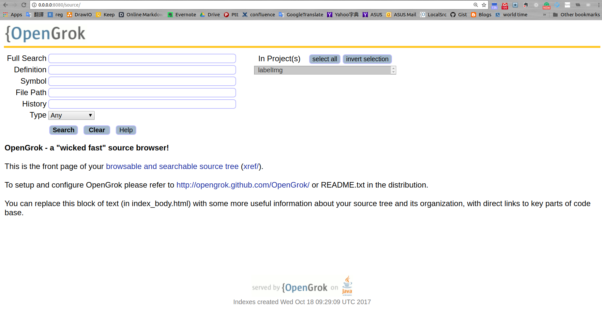

# Opengrok dockerfile

### Build

```
$ make build
```

### Run

```
$ make run dir=[Absolute Path]
```


### Demo

```
# make build
$ bash -c "nohup sh sync_repo.sh $* &> /dev/null"  &
$ make run dir=$PWD/localsrc
```

```
Open your browser http://0.0.0.0:8080/source/
```


